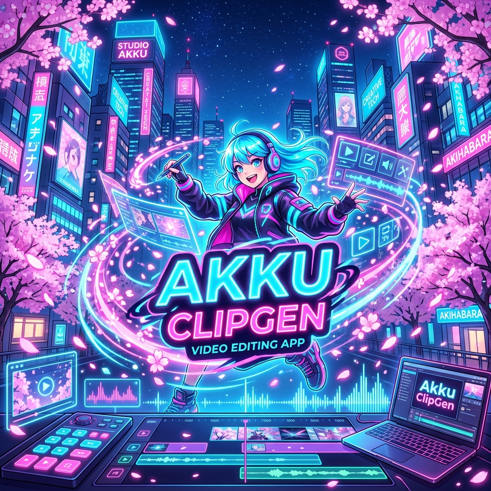
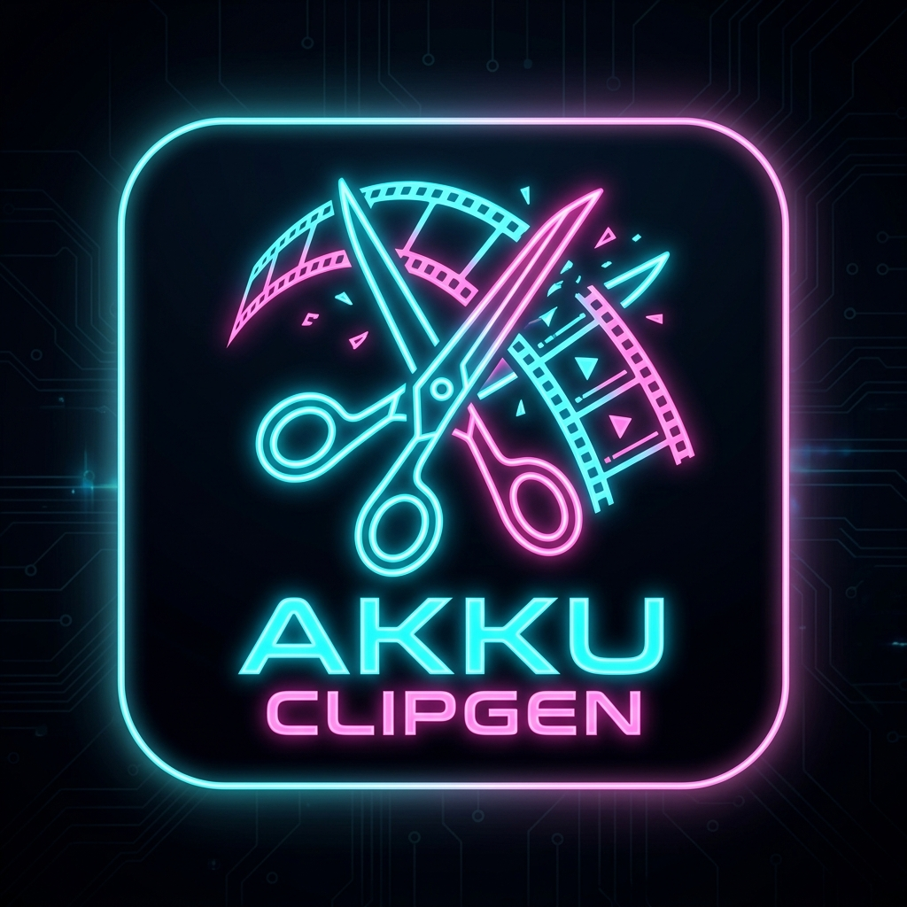

<div align="center">
  


# 🌸 AKKU CLIPGEN 🌸
`✦ ─── ⋆ 💮 ⋆ ─── ✦`

**A high-performance local video/audio cropper and segmenter styled with a premium Cyber-Neon Anime aesthetic.**

🌐 **[Live Demo / Deployment Link](https://akku-clip-gen.vercel.app)**
💻 **[GitHub Repository](https://github.com/ankitdas37/Akku-ClipGen)**

[](https://nextjs.org/)
[](https://nodejs.org/)
[](https://ffmpeg.org/)
[]()

</div>

<br />

Designed for rapid content generation, it utilizes zero-loss stream copying via `ffmpeg` to clip videos in a fraction of a second, wrapped in a beautiful, interactive visual dashboard.

<div align="center">
  
</div>

---

## 🎐 What is Akku ClipGen & Features

**Akku ClipGen** is a modern, anime-themed local web application built for creators to instantly cut, crop, and generate segments from large video files without any quality loss. It handles gigabytes of video locally on your machine with blazing speed.

### ✨ Key Features

| Feature | Description |
| :--- | :--- |
| ⚡ **Zero-Loss Clipping** | Invokes native `ffmpeg` with stream copying (`-c copy`). A 1-hour video splits into chunks in seconds with bit-for-bit lossless quality. Works with `MP4`, `MKV`, `AVI`, `MOV`, `WebM`, `FLV`, etc. |
| 🎨 **Anime Cyber-Design** | Interactive canvas particles, glassmorphic interfaces, dynamic micro-animations, and curated HSL neon themes. |
| 📧 **Contact Center** | Fully functional contact page with local storage persistence and automated email notifications via Nodemailer. |
| 🛡️ **Multi-Admin Dashboard**| A secure command center to view, reply, and manage messages. Support for multiple secondary admin accounts. |

---

## 🛠️ Technology Stack Used

| Technology | Purpose | Description |
| :--- | :--- | :--- |
| ⚛️ **[Next.js 14.2](https://nextjs.org/)** | Framework | React framework for server-side rendering, routing, and full-stack architecture. |
| 🟢 **[Node.js](https://nodejs.org/)** | Runtime | JavaScript runtime for backend API processing and local file system operations. |
| 🎬 **[FFmpeg](https://ffmpeg.org/)** | Engine | The core media manipulation engine used to crop and process video without re-encoding. |
| ✉️ **[Nodemailer](https://nodemailer.com/)**| Emails | Used for sending automated email notifications directly from the application via SMTP. |
| 🎨 **Vanilla CSS** | Styling | Custom Properties (Variables) to create the dynamic glassmorphic and glowing cyber-neon themes. |
| 💾 **Local Persistence**| Database | Node.js `fs` module to store persistent data locally in `tmp/data/`. |

---

## 🔐 Security Mechanisms

Akku ClipGen implements modern security practices to protect the Admin Dashboard:

* 🔑 **Stateless Token Authentication:** Uses the **Web Crypto API (HMAC-SHA256)** to cryptographically sign session tokens, verifying users securely on the edge middleware.
* 🛡️ **Next.js Edge Middleware:** Intercepts any request to `/admin` routes, validating the HMAC signature before granting access.
* 🍪 **HttpOnly Session Cookies:** Stores the session token in an `HttpOnly` cookie, rendering it completely inaccessible to client-side JavaScript and blocking XSS attacks.
* ⏳ **Anti-Brute Force Delay:** Implements a synthetic `800ms` delay on failed login attempts to dramatically slow down automated password guessing attacks.
* 🔒 **Secondary Admin Hashing:** Passwords for additional admins are irreversibly hashed using **SHA-256** before being saved to the local database.

---

## 🚀 How to Setup and Run

If you want to clone this project or set it up on a new machine, follow these simple steps:

### 1. Summon the Source Code
Download or clone the repository to your new machine.
Ensure you have **[Node.js](https://nodejs.org/)** installed (v18+ recommended).

### 2. Install the Components
Open your terminal, navigate into the downloaded folder, and run:
```bash
npm install
```

### 3. Setup the Security Seals (Environment Variables)
Create a `.env.local` file in the root folder and add the following configuration:
```env
# ── Admin Panel Credentials ──
ADMIN_USERNAME=admin
ADMIN_PASSWORD=1234
ADMIN_SECRET=your-super-long-secret-key-change-this

# ── Email / SMTP Configuration ──
SMTP_HOST=smtp.gmail.com
SMTP_PORT=465
SMTP_USER=your-email@gmail.com
SMTP_PASS=your-app-password
ADMIN_EMAIL=your-email@gmail.com
```

> [!NOTE]
> **📧 How to Setup Gmail SMTP (App Passwords)**
> To allow the application to send emails from your Gmail account, you must generate an **App Password**:
> 1. Go to your [Google Account Security settings](https://myaccount.google.com/security).
> 2. Ensure **2-Step Verification** is turned on.
> 3. Search for **"App Passwords"** in the top search bar of your Google account.
> 4. Create a new App Password (name it "Akku ClipGen").
> 5. Copy the 16-character password generated and paste it as your `SMTP_PASS` in the `.env.local` file (no spaces).
> 6. Set both `SMTP_USER` and `ADMIN_EMAIL` to your Gmail address.

### 4. Cast the Dev Server
Launch the application:
```bash
npm run dev
```
Open [http://localhost:3000](http://localhost:3000) in your browser.

---

## 📂 Project Architecture

```text
Akku ClipGen/
├── app/
│   ├── admin/                # 🛡️ Admin command dashboard & Multi-admin panel
│   │   ├── login/            # Anime style login console
│   │   └── page.js           # Admin messages reader & replies
│   ├── api/
│   │   ├── admin/            # Session & Admin management API
│   │   ├── messages/         # Message retrieval & creation API
│   │   ├── cleanup/          # File maintenance endpoint
│   │   ├── generate/         # Video clipping engine endpoint
│   │   ├── preview/          # Video preview generator
│   │   └── upload/           # Video upload handler
│   ├── components/           # 🎨 Interactive UI elements
│   ├── contact/              # 📧 Customer feedback panel
│   ├── globals.css           # 🎨 Core design token system
│   ├── layout.js             # HTML layout wrapper
│   └── page.js               # 🏠 Main workspace page
├── tmp/                      # 💾 Local storage (Clips, Uploads, JSON DB)
├── middleware.js             # 🛡️ Authentication Edge middleware
└── package.json              # Project dependencies
```

---

## 💫 Developed By

<div align="center">


### Ankit Das
**Developer 🚀**

*Passionate about building magical, beautiful, and high-performance web applications! 🌸*

### 🤝 Connect With Me

[](mailto:ankitdas082006@gmail.com)
[](https://www.linkedin.com/in/akku-clip-gen-8106b12ba/)
[](https://www.instagram.com/the.ankit.das)
[](https://x.com/AnkitDa01860054)

<br/>

`✦ ─── ⋆ 🌸 ⋆ ─── ✦`
*May your clips render instantly and your styling stay cybernetic!*

</div>
# Akku-ClipGen

